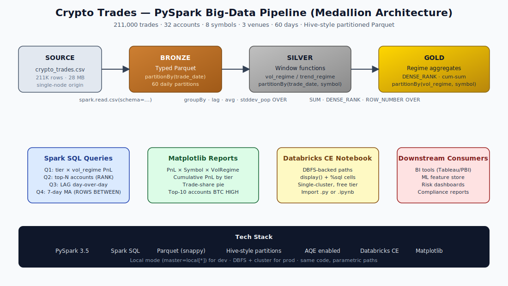

# Crypto Trades — Big-Data Pipeline with PySpark

> Re-architected a **211,000-row crypto trades** dataset from Pandas to a
> production-shaped **PySpark + Spark SQL + partitioned Parquet** pipeline,
> with a Databricks Community Edition notebook for cloud execution.



---

## TL;DR

- **211,000 synthetic crypto trades** across **32 accounts**, **8 symbols**, **3 venues**, **60 days**.
- Medallion architecture: **Bronze → Silver → Gold** Parquet, Hive-style partitioned (`/vol_regime=high/symbol=BTC-USD/`).
- **Spark SQL window functions** (`DENSE_RANK`, `LAG`, `AVG OVER ROWS BETWEEN`) for regime-based aggregation.
- Same code runs **locally** (`master=local[*]`) and on **Databricks Community Edition** unchanged.
- End-to-end pipeline runs in **~60 seconds** on a 2-core machine.

---

## About the data

The raw CSV (`data/raw/crypto_trades.csv`, ~28 MB) and the Parquet warehouse
(`data/warehouse/`, ~53 MB) are **not committed to this repo on purpose**.
They are fully **regeneratable in seconds** from the scripts in `src/`.
This is standard data-engineering practice — commit the code that produces
the data, not the data itself.

To recreate everything, follow the **Quickstart** below.

### Synthetic dataset details

The generator (`src/generate_data.py`) produces realistic crypto trade data:

- **211,000 trades** across **32 accounts** distributed across 3 tiers
  (`retail` / `prop` / `market_maker`), each with different fee schedules
  and trade-size distributions.
- **8 symbols** (BTC, ETH, SOL, ADA, AVAX, MATIC, DOT, LINK) with mid-prices
  following **Geometric Brownian Motion** with three injected volatility
  regimes (low → high → medium) over a 60-day window.
- **3 venues** (Coinbase, Binance, Kraken) with different bid-ask spreads.
- Fills are computed as `mid ± half_spread`; PnL is a 30-minute
  forward-price proxy net of fees.

This makes the downstream regime classification actually meaningful —
not synthetic noise that all looks the same.

### Schema (15 columns)

| Column         | Type      | Description                                     |
| ---            | ---       | ---                                             |
| `trade_id`     | string    | Unique trade identifier (e.g. `T1000042`)        |
| `ts`           | timestamp | Trade timestamp (UTC, second precision)         |
| `account_id`   | string    | One of 32 accounts (`ACC1000` … `ACC1031`)      |
| `tier`         | string    | `retail` / `prop` / `market_maker`              |
| `symbol`       | string    | Crypto pair, e.g. `BTC-USD`                     |
| `venue`        | string    | `coinbase` / `binance` / `kraken`               |
| `side`         | string    | `BUY` / `SELL`                                  |
| `quantity`     | double    | Units of base asset traded                      |
| `fill_price`   | double    | Executed price                                  |
| `mid_price`    | double    | Mid price at the moment of execution            |
| `notional`     | double    | `fill_price * quantity` (USD)                   |
| `fee_bps`      | double    | Fee in basis points (tier-dependent)            |
| `fee_amount`   | double    | `notional * fee_bps / 10_000`                   |
| `realized_pnl` | double    | Net P&L vs. +30-min mid, after fees             |
| `trade_date`   | string    | `YYYY-MM-DD` — Hive partition key               |

---

## Quickstart

### Prerequisites

- Python 3.10 or newer
- Java 11 or 17 (required by PySpark — check with `java -version`)

### Run the full pipeline

```bash
git clone https://github.com/<YOUR_USERNAME>/crypto-spark-pipeline.git
cd crypto-spark-pipeline

pip install -r requirements.txt

python src/generate_data.py         # builds data/raw/crypto_trades.csv  (~5 s)
python src/pipeline.py              # Bronze + Silver + Gold              (~60 s)
python src/spark_sql_queries.py     # runs 5 demo Spark SQL queries
python src/make_charts.py           # writes output/charts/*.png
```

After running, your project tree will look like:

```
crypto-spark-pipeline/
├── data/
│   ├── raw/crypto_trades.csv         ← regenerated (28 MB)
│   └── warehouse/
│       ├── bronze_trades/            ← partitioned by trade_date
│       ├── silver_trades/            ← partitioned by trade_date, symbol
│       └── gold/
│           ├── agg_by_vol_regime/                ← partitioned by vol_regime
│           ├── account_ranking_by_regime/        ← partitioned by vol_regime, symbol
│           └── daily_pnl_by_tier_trend/          ← partitioned by trade_date
└── output/charts/*.png               ← regenerated
```

### Run on Databricks Community Edition

1. Sign up free at <https://community.cloud.databricks.com>.
2. Create a cluster (CE gives one free 15 GB cluster).
3. Either upload `data/raw/crypto_trades.csv` (generate it locally first)
   to **DBFS** under `/FileStore/crypto/`, or paste the contents of
   `src/generate_data.py` into a notebook cell on the cluster.
4. Import `notebooks/databricks_crypto_pipeline.py` (Databricks auto-detects
   the `# COMMAND ----------` cell breaks) or `.ipynb`.
5. Attach to the cluster and **Run all**.

The notebook auto-detects whether it's running on Databricks or locally and
swaps `dbfs:/…` ↔ `file://…` paths accordingly.

---

## Pipeline architecture (medallion)

| Layer  | Format           | Partition key(s)                  | Purpose                                          |
| ---    | ---              | ---                               | ---                                              |
| Raw    | CSV              | none                              | The original drop                                |
| Bronze | Parquet (snappy) | `trade_date`                      | Typed, fast columnar replay (60 daily parts)     |
| Silver | Parquet (snappy) | `trade_date`, `symbol`            | Enriched with **vol_regime** + **trend_regime**  |
| Gold   | Parquet (snappy) | `vol_regime`, `(vol_regime,symbol)`, `trade_date` | Analyst-ready aggregates with **rankings**       |

Inspect the Hive-style on-disk layout after running the pipeline:

```bash
find data/warehouse/gold -maxdepth 3 -type d
# data/warehouse/gold/account_ranking_by_regime/vol_regime=high/symbol=BTC-USD
# data/warehouse/gold/account_ranking_by_regime/vol_regime=high/symbol=ETH-USD
# ...
```

The `vol_regime=high/symbol=BTC-USD/` directory naming is **identical to Hive
partitioning** and lets Spark perform **partition pruning** when you query
with a `WHERE vol_regime='high'` predicate.

---

## Window-function transforms

Inside `build_silver()`:

```python
w_sym    = Window.partitionBy("symbol").orderBy("ts_min")
w_sym_20 = w_sym.rowsBetween(-19, 0)

bars = (minute_bars
    .withColumn("prev_mid",   F.lag("mid_min", 1).over(w_sym))
    .withColumn("log_return", F.log(F.col("mid_min") / F.col("prev_mid")))
    .withColumn("sma_20",     F.avg("mid_min").over(w_sym_20))
    .withColumn("vol_20",     F.stddev_pop("log_return").over(w_sym_20)))
```

Per-symbol terciles of `vol_20` (via `approxQuantile`) give us a
**`vol_regime ∈ {low, medium, high}`** label. An SMA20 vs SMA60 comparison
gives us **`trend_regime ∈ {bull, bear, chop}`**.

Inside `build_gold()` (pure Spark SQL window functions):

```sql
DENSE_RANK() OVER (PARTITION BY vol_regime, symbol ORDER BY total_pnl DESC) AS pnl_rank,
SUM(total_pnl) OVER (PARTITION BY vol_regime, symbol ORDER BY total_pnl DESC
                     ROWS BETWEEN UNBOUNDED PRECEDING AND CURRENT ROW) AS cumulative_pnl
```

---

## Results


---

## Verified on Databricks (Free Edition · Serverless · Unity Catalog)

The complete pipeline runs end-to-end on **Databricks Free Edition** using
**serverless compute**, with outputs persisted as **Unity Catalog managed
tables** (`workspace.default.crypto_bronze`, `crypto_silver`, `crypto_gold_agg`)
partitioned by `trade_date`, `symbol`, and `vol_regime`.

### Serverless compute running the workload


### Spark SQL aggregation — PnL by tier × volatility regime
9 rows in **3.88 seconds** — multi-dim GroupBy across 32 accounts × 3 tiers × 3 regimes.


### `DENSE_RANK` window function — top-3 accounts per (vol_regime, symbol)
72-row leaderboard in **1.73 seconds**. Market-maker accounts dominate rank 1
in 7 of 8 symbols — the spread-earner economic signal coming through cleanly.


### End-to-end pipeline — Gold-layer chart + Unity Catalog managed tables


> Same PySpark + Spark SQL logic as the local version in `src/pipeline.py`.
> Only the write API swaps from `.parquet(path)` to `.saveAsTable(name)` to
> work within Free Edition's filesystem restrictions — storage backend is
> still Parquet underneath, managed by Unity Catalog.

---

## Repo layout

```
crypto-spark-pipeline/
├── src/
│   ├── generate_data.py        # Builds 211K synthetic trades (GBM + regime shifts)
│   ├── pipeline.py             # Bronze → Silver → Gold (the main job)
│   ├── spark_sql_queries.py    # 5 demo Spark SQL queries
│   ├── make_charts.py          # PySpark → pandas → matplotlib
│   └── build_ipynb.py          # Converts the Databricks .py → .ipynb
├── notebooks/
│   ├── databricks_crypto_pipeline.py    # Databricks source-format notebook
│   └── databricks_crypto_pipeline.ipynb # Same notebook as .ipynb
├── output/charts/              # PNG charts rendered from gold tables
├── docs/
│   ├── architecture.svg
│   └── interview_defense.md
├── requirements.txt
├── NEXT_STEPS.md
└── README.md
```

---

## Performance / design notes

- `spark.sql.adaptive.enabled = true` (AQE) — coalesces post-shuffle partitions automatically, important once the data outgrows a laptop.
- `spark.sql.shuffle.partitions = 16` overrides the 200-default for our 211K-row workload; on a real cluster you'd tune this to roughly `cluster_cores * 2–3` or rely on AQE.
- Bronze CSV reads use an **explicit `StructType` schema** rather than `inferSchema=true` — production practice, avoids a full scan just to detect types and gives stable plans.
- `broadcast(thr_df)` on the tiny per-symbol threshold table avoids a shuffle join.
- Gold tables are partitioned on the **filter keys analysts actually use** (`vol_regime`, `symbol`, `trade_date`), enabling partition pruning visible in `EXPLAIN`.

> The same code that runs on `master=local[*]` in this sandbox runs on a
> Databricks cluster unchanged — `master` is read from `SPARK_MASTER`, paths
> are read from constants at the top.

---

## Tech stack

`PySpark 3.5` · `Spark SQL` · `Parquet (snappy)` · `Hive-style partitions` · `Adaptive Query Execution` · `Databricks Community Edition` · `Matplotlib` · `Python 3.10+`

---

## License

MIT — use freely. Attribution appreciated but not required.
