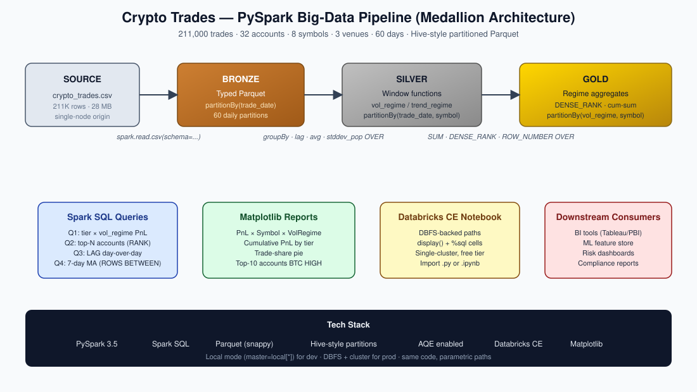

# Crypto Spark Pipeline

> Production-shaped big-data pipeline for 211K synthetic crypto trades using PySpark, Spark SQL, partitioned Parquet, and Databricks.



## Overview

This project re-architects a crypto-trade workload into a **Bronze → Silver → Gold** data pipeline. It demonstrates practical Spark engineering: explicit schemas, partitioning, window functions, adaptive query execution, Spark SQL, reproducible data generation, and local/Databricks execution.

## At a glance

| Metric | Value |
|---|---:|
| Synthetic trades | 211,000 |
| Accounts | 32 |
| Symbols | 8 |
| Venues | 3 |
| Time window | 60 days |
| Pipeline runtime | ~60s on a 2-core machine |

## Architecture

```text
Raw CSV
  │
  ▼
Bronze — typed Parquet, partitioned by trade_date
  │
  ▼
Silver — enriched regimes + window features
  │
  ▼
Gold — analyst-ready aggregates + rankings
  │
  ├── PnL by volatility regime
  ├── Account rankings by symbol/regime
  └── Daily PnL trends by tier
```

## Engineering highlights

- Explicit `StructType` schema instead of `inferSchema`.
- Snappy-compressed Parquet throughout the warehouse layers.
- Hive-style partitioning for efficient filtering and partition pruning.
- Spark SQL window functions including `LAG`, `AVG OVER`, and `DENSE_RANK`.
- Adaptive Query Execution enabled for shuffle optimization.
- Broadcast join for small threshold data.
- Same core logic supports local Spark and Databricks execution.
- Raw and generated warehouse data are intentionally excluded from Git; the dataset is reproducible from source.

## Data model

The generator creates realistic synthetic trades across three account tiers, eight symbols, and three venues. Prices follow geometric Brownian motion with injected volatility regimes; fills, fees and forward-price PnL are derived from the generated market data.

## Quickstart

Prerequisites: Python 3.10+ and Java 11 or 17.

```bash
git clone https://github.com/EvilSnIzer/Crypto-spark-pipeline.git
cd Crypto-spark-pipeline
pip install -r requirements.txt

python src/generate_data.py
python src/pipeline.py
python src/spark_sql_queries.py
python src/make_charts.py
```

## Databricks

The repository includes Databricks-compatible notebooks and verified serverless execution. The same PySpark/Spark SQL transformation logic is used locally and in Databricks; only the storage API changes where required by the platform.

## Results

The pipeline produces Gold-layer analytics and visualizations. The Databricks verification includes Spark SQL aggregations, account ranking with `DENSE_RANK`, and end-to-end pipeline output.

## Repository structure

```text
src/
├── generate_data.py
├── pipeline.py
├── spark_sql_queries.py
├── make_charts.py
└── build_ipynb.py
notebooks/
docs/
output/charts/
requirements.txt
NEXT_STEPS.md
README.md
```

## Tech stack

`Python 3.10+` · `PySpark 3.5` · `Spark SQL` · `Parquet` · `Databricks` · `Matplotlib`

## License

MIT
